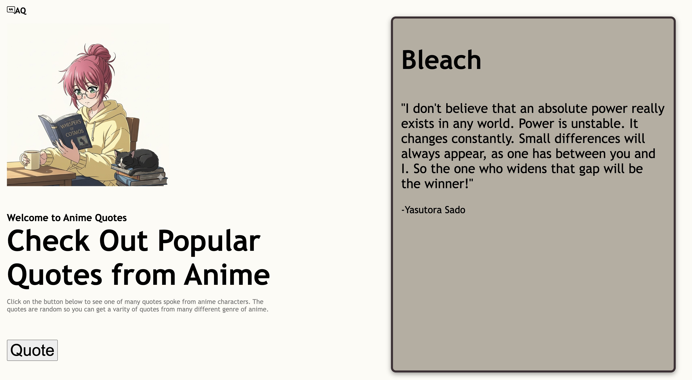

# SBA 308A: JavaScript Web Application

# 🎌 Anime Quotes
 
> A simple web application that displays random quotes from anime characters at the click of a button.
 
---
 
## 📸 Screenshot
 

 
---

### Assignment:
### Introduction
This assessment measures your capability to implement advanced JavaScript tools and features in a practical manner. You have creative freedom in the topic, material, and purpose of the web application you will be developing, so have fun with it! However, remember to plan the scope of your project to the timeline you have been given.

### Objectives
- Use asynchronous JavaScript tools to build a responsive web application.
- Demonstrate understanding of the JavaScript event loop.
- Generate asynchronous code using Promises and async/await syntax.
- Use fetch and/or Axios to interact with an external web API.
- Organize files using modules and imports.

### Build With:
This section should list any major frameworks/libraries used to bootstrap your project. Leave any add-ons/plugins for the acknowledgements section. Here are a few examples.

### Acknowledgements
<!-- MARKDOWN LINKS & IMAGES -->
* [Anime Quotes](https://yurippe.vercel.app/) for the API 